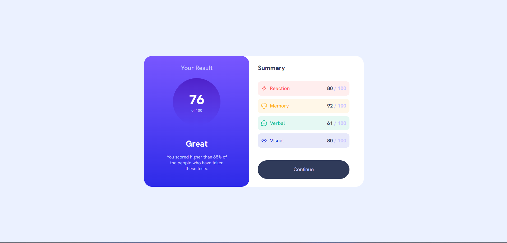

# Frontend Mentor - Results summary component solution

This is a solution to the [Results summary component challenge on Frontend Mentor](https://www.frontendmentor.io/challenges/results-summary-component-CE_K6s0maV). Frontend Mentor challenges help you improve your coding skills by building realistic projects. 

## Table of contents

  - [Screenshot](#screenshot)
  - [Links](#links)
  - [Built with](#built-with)
  - [Author](#author)

### Screenshot

### Links

- Solution URL: [Add solution URL here](https://github.com/Unknownbosss/Frontend-Mentor-Results-summary-component-solution/)
- Live Site URL: [Add live site URL here](https://frontendmentor-resultssummary.netlify.app/)

### Built with

- Semantic HTML5 markup
- CSS custom properties
- Flexbox
- CSS Grid
- Mobile-first workflow

### Author

- Website - [Udeigwe Emmanuel](https://www.your-site.com)
- Frontend Mentor - [@Unknownbosss](https://www.frontendmentor.io/profile/Unknownbosss)
- Twitter - [@UdeigweEmmanuel](https://www.twitter.com/UdeigweEmmanuel)

